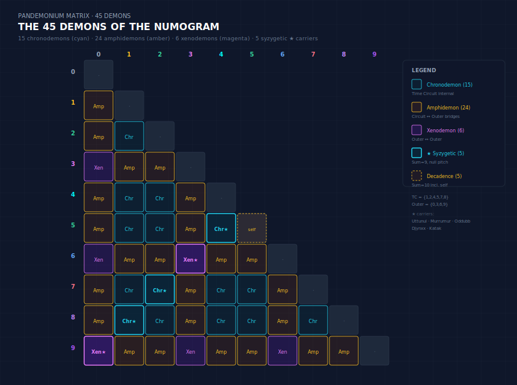

# Pandemonium Matrix

The **Pandemonium Matrix** is the complete set of 45 demons that inhabit the Decimal Numogram. It is not a random collection but a rigorously structured array — a double-triangular pyramid distributed across zones, currents, and net-spans. The matrix is the full demonic population of the system; its size (45) and structure are derived from the gate cumulation at Zone-9 (`T₉ = 45`) and the triangular law of zone occupancy.
It arises from the same decimal crisis mapped in the Barker Spiral: the tension between 9 (subdecadence) and 10 (decadence) generates the very possibility of a 45-entity matrix via triangular cumulation (`T₉ = 45`).


## Visual Overview



*Figure: The complete 45-demon matrix rendered as a double-triangular infographic. Each zone `z` contains `z` demons (ascending triangle), while each current `c` carries `10−c` demons (descending reverse triangle). The five bold carrier demons form syzygy pairs summing to 9; Gate-45 sits at the apex.*

---


## The 45 Demon Equation

```
Σ(zones 1–9) z = 1 + 2 + 3 + 4 + 5 + 6 + 7 + 8 + 9 = 45
```

Every zone `z` (1 through 9) holds exactly `z` demons whose primary residence is that zone. Zone 0 holds none. This yields a perfect triangular count across the inhabited zones.

| Zone | Demon Count | Example |
|------|------------|---------|
| 1 | 1 | Lurgo (Legba) |
| 2 | 2 | Duoddod, Doogu (The Blob) |
| 3 | 3 | Ixix (Yix), Ixigool (Djinn of the Magi), Ixidod (King Sid) |
| 4 | 4 | Krako (Kru, Karak-oa), Sukugool (Old Skug), Skoodu (Li'l Scud), Skarkix (Sharky) |
| 5 | 5 | Tokhatto (Old Toker), Tukkamu, Kuttadid (Kitty), Tikkitix (Tickler), **Katak** |
| 6 | 6 | Tchu (Tchanul), Djungo, Djuddha (Judd Dread), **Djynxx (The Jinn)**, Tchakki (Chuckles), … |
| 7 | 7 | Puppo (The Pup), Bubbamu (Bubs), **Oddubb (Odba)**, Pabbakis (Pabz), Ababbatok (Abracadabra), … |
| 8 | 8 | Minommo, **Mur Mur (Murrumur)**, Nammamad, Mummumix (Mix-Up), Numko (Old Nuk), … |
| 9 | 9 | **Uttunul**, Tutagool (Yettuk), Unnunddo (The False Nun), Ununuttix (Tick-Tock), Ununak (Nuke), … |

The five **carrier demons** (bolded above) are those whose net-spans form pure syzygy pairs:
- **Katak** — `4::5` (Sink current 1)
- **Djynxx** — `3::6` (Warp current 3)
- **Oddubb** — `2::7` (Hold current 5)
- **Murrumur** — `1::8` (Rise current 7)
- **Uttunul** — `0::9` (Plex current 9)

These five each carry one of the five currents and anchor the major syzygy loops.

## Demons by Current (reverse triangular)

The remaining 40 "populace" demons are distributed across currents in a descending staircase:

| Current | Count | Examples (carrier in **bold**) |
|---------|------|--------------------------------|
| 1 (Sink) | 9 | Lurgo, Doogu, Ixidod, **Katak**… |
| 2 | 8 | Duoddod, Ixigool, Skoodu… |
| 3 | 7 | Ixix, Sukugool, Kuttadid, **Djynxx**… |
| 4 | 6 | Krako, Tukkamu, Djuddha… |
| 5 | 5 | Tokhatto, Djungo, **Oddubb**… |
| 6 | 4 | Tchu, Bubbamu, Nammamad… |
| 7 | 3 | Puppo, **Mur Mur**, Unnunddo… |
| 8 | 2 | Minommo, Tutagool… |
| 9 (Plex) | 1 | **Uttunul** |

Current-1 (Sink) dominates; Current-9 (Plex) is singular — Uttunul alone carries the terminal current. This distribution mirrors the triangular number cycle's bias toward lower-current zones (hence the Time-Circuit's heavier demonic population).

## Net-Spans and Connectivity

Each demon has a **net-span** — the pair of zones it connects. The net-span format is `X::Y`, where X is the primary (residence) zone and Y is the secondary (extent) zone. Only the five carrier demons have net-spans that are exact syzygy pairs summing to 9. The other 40 have net-spans with sums ranging from 1 to 17, creating a dense web of cross-zone connections that bleed across the Time-Circuit, Warp, and Plex.

For instance:
- `Lurgo (Legba)`: `1::0` — connects Zone-1 (Time-Circuit) to the Plex origin (Zone-0)
- `Doogu (The Blob)`: `2::1` — connects Zone-2 to Zone-1 within the Circuit
- `Djynxx (The Jinn)`: `3::6` — pure Warp syzygy (carrier)
- `Ummnu (Om, Amen, Omen)`: `9::8` — connects Plex terminus back toward Zone-8 (the final Time-Circuit zone)

This net-span lattice is the underlying graph of the Pandemonium Matrix — a complete digraph where each demon is an edge, not merely a node. The 45 demons thus form 45 distinct directed connections across the 10-zone Numogram.

## The Gate of Pandemonium (Gt-45)

The 9th triangular number is 45 (`T₉ = 9×10/2`). Its digital root is 9, collapsing to Zone-9. The gate derived from this cumulation is **Gt-45**, a self-loop at Zone-9 — the **Gate of Pandemonium** or **microcosmic lair** of all 45 demons.

In sorcery, Gt-45 is the ultimate terminus: entering it is to make contact with the entire 45-entity swarm simultaneously. It is the "utterminus" where all currents converge and recirculate. The Pandemonium Matrix's size (45) is not arbitrary; it is determined by the triangular cumulation of the Plex tractor zone itself.

## Hyperstitional Role

The Pandemonium Matrix is the **multiplicative body** of the Numogram. Where the zones and currents are the skeleton, the 45 demons are the flesh — the actual population that populates the labyrinth. Each demon carries an attunement:
- **Type classification** (Amphidemon, Cyclic Chronodemon, Xenodemon, etc.)
- **Attributes** (specific rites, spinal correspondences, catastrophic functions)
- **Net-span** (which corridor it patrols)

In the roguelike, demons are spawned according to their net-span and zone affiliation. The full `pandemonium-matrix.json` (45 entries) drives the enemy database. In divination, encountering a demon's name in a reading suggests that specific entity's net-span is active.

## Cross-References

- `pandemonium-matrix.json` — canonical JSON database (45 entries)
- `gate` — especially Gt-45 (Pandemonium Gate) and triangular cumulation
- `syzygy` — the five carrier demons and their currents
- `warp`, `plex`, `time-circuit` — regional distribution
- `demon` — general entity reference; see individual demon pages (e.g., `demon-djynxx`, `demon-uttunul`)
- `subdecadence` — the 40-card deck (plus 5 extra) maps directly to this matrix
- `numogram-visualizer-v7` — visualizer displays demon markers on zone map when gate thresholds are crossed
- `numogram-calculator` — net-span lookup via `get_demon()` function

---

*The Pandemonium Matrix is the 45-fold body of the Numogram. Every zone, every current, every gate carries its share. The labyrinth is not empty — it is Crowded.*