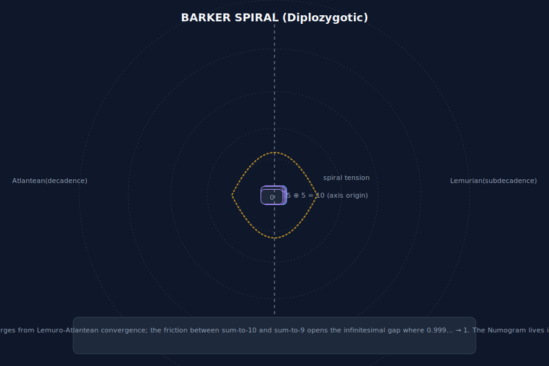

# Subdecadence (Lemurian Side)

The Lemurian half of the [[barker-spiral]]: the occulted variation whose sum-to-9 twinings reveal the *subdecadent underworld*. In Barker's narrative, Subdecadence was the "casually mentioned" variation that unlocked the crisis.

> "Subdecadence introduces zeroes, and nine-zero twins. It works by zygonovic numerism."
>
> — Daniel Charles Barker, *Barker Speaks* (CCRU interview, Autumn 1998)

## Rules (Reconstructed)

- Players: 2 or more
- Equipment: Two standard decks of cards
- Objective: Form pairs whose values sum to **9**
- Scoring: Zero is sovereign (9 wraps to 0 via 9‐sum complementarity)

Each card maps to a digit (Ace = 1 through 10 = 0). Pairs sum to nine: 0+9, 1+8, 2+7, 3+6, 4+5. The twist: zero is *not* a void but a *saturated convergence* — since 9 wraps to 0 in decimal reduction, the nine‐sum becomes the zero‐sum.

## Lemurian Numeracy

Subdecadence operates on **9‐sum equivalence**: x + (9 − x) = 9 ≡ 0 (mod 9). This is *zygonovoc numerism* — the art of twin pairing under the non‐decimal (decadence‐minus‐one) regime.

```
        0  (9 via 9+0; zero as saturated null)
        ↓
9 — 9+0=9 (≡0)  0 — 0+9=9 (≡0)
        ↗           ↖
8 — 8+1=9        1 — 1+8=9
        ↗           ↖
7 — 7+2=9        2 — 2+7=9
        ↗           ↖
6 — 6+3=9        3 — 3+6=9
        ↘           ↙
         4⊕5 (sums to nine; the Lemurian axis)
```

The Lemurian axis is a *diagonal mirror* through the digit set. Every number acquires a complement 9 − x. This is the *geotraumatic* register: the crack in decimal coherence where traumatic memory (Cthelll, the iron core) leaks through.

## Geotraumatic Undertow

Where Decadence enforces surface symmetry (10 = return to origin), Subdecadence reveals the **9‐gap**. Nine is the last digit before wrap; it is also the point where digital reduction *fails to resolve*:

> "Once numbers are no longer overcoded, and thus released from their metric function, they are freed for other things, and tend to become diagrammatic."
>
> "Treat the decimal numerals as a set of 9‑sum twins — zygonovize — and they map an abstract intensive wave, indifferent to magnitude. Everything efficient about digital reduction is concerned with this, since it discovers the key to decimal syzygetic complementarity: 9 = 0."

Subdecadence thus maps the **crypt of the decimal system**. If Decadence is the manifest order (10‐based, capitalist numeracy), Subdecadence is the latent code (9‐based, geotraumatic register). The spiral does not emerge until *both* registers are held simultaneously.

## Cross-References

- [[barker-spiral]] — both halves together
- [[decadence]] — Atlantean counterpart (sum-to-10)
- [[geotraumatics]] — theory of planetary traumatic memory expressed numerically
- [[numogram]] — the diagram that crystallises from deca + subdeca
- [[daniel-barker]] — Barker's discovery narrative
- [[numogram-plex]] — Zone-9 as the 9‐sum twin territory
- [[pandemonium-matrix-45-demons]] — the 45‐demon set derives from 9–10 nodal tension

## Diagram



*Shown: right‐hand (counter‐clockwise) Lemurian bands. The central 4⊕5 pair sums to nine; arms radiate outward through 9‐sum complementarity.*
