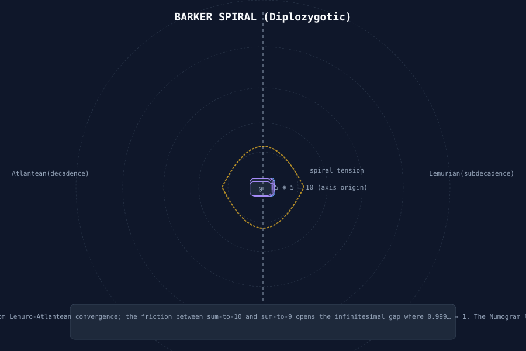

# Subdecadence (Lemurian Side)

The Lemurian half of the [[barker-spiral]]: the occulted variation whose sum-to-9 twinings reveal the *subdecadent underworld*. In Barker's narrative, Subdecadence was the "casually mentioned" variation that unlocked the crisis.

A live playable implementation exists: [doomcrypt/subdecadence](https://doomcrypt.github.io/subdecadence/) — a single-file browser card game governed by the great lemur Tokhatto. See also: [[Angelic Index]] and [[pandemonium-matrix]].

> "Subdecadence introduces zeroes, and nine-zero twins. It works by zygonovic numerism."
>
> — Daniel Charles Barker, *Barker Speaks* (CCRU interview, Autumn 1998)

## Rules (Reconstructed)

- Players: 2 or more
- Equipment: Two standard decks of cards
- Objective: Form pairs whose values sum to **9**
- Scoring: Zero is sovereign (9 wraps to 0 via 9‐sum complementarity)

Each card maps to a digit (Ace = 1 through 10 = 0). Pairs sum to nine: 0+9, 1+8, 2+7, 3+6, 4+5. The twist: zero is *not* a void but a *saturated convergence* — since 9 wraps to 0 in decimal reduction, the nine‐sum becomes the zero‐sum.

## Lemurian Numeracy

Subdecadence operates on **9‐sum equivalence**: x + (9 − x) = 9 ≡ 0 (mod 9). This is *zygonovoc numerism* — the art of twin pairing under the non‐decimal (decadence‐minus‐one) regime.

```
        0  (9 via 9+0; zero as saturated null)
        ↓
9 — 9+0=9 (≡0)  0 — 0+9=9 (≡0)
        ↗           ↖
8 — 8+1=9        1 — 1+8=9
        ↗           ↖
7 — 7+2=9        2 — 2+7=9
        ↗           ↖
6 — 6+3=9        3 — 3+6=9
        ↘           ↙
         4⊕5 (sums to nine; the Lemurian axis)
```

The Lemurian axis is a *diagonal mirror* through the digit set. Every number acquires a complement 9 − x. This is the *geotraumatic* register: the crack in decimal coherence where traumatic memory (Cthelll, the iron core) leaks through.

## Subdecadence as the Numogram's Structural Base

Where Decadence enforces surface symmetry (10 = return to origin), Subdecadence reveals the **9-gap** as the system's true generative principle. The numogram *generally leans Lemurian*: 9 is the "highest" sum, with 0 as the "empty summit," as opposed to systems that would regard 10 as the basis (Kabbalistic Tree of Life and so on).

> "Once numbers are no longer overcoded, and thus released from their metric function, they are freed for other things, and tend to become diagrammatic."
>
> "Treat the decimal numerals as a set of 9-sum twins — zygonovize — and they map an abstract intensive wave, indifferent to magnitude. Everything efficient about digital reduction is concerned with this, since it discovers the key to decimal syzygetic complementarity: 9 = 0."

Subdecadence thus maps the **crypt of the decimal system**. If Decadence is the manifest order (10-based, capitalist numeracy), Subdecadence is the latent code (9-based, geotraumatic register). The spiral does not emerge until *both* registers are held simultaneously.

### Current Derivation

In any syzygy, the **current** is the absolute difference between the paired numbers. This is the directed flow that traverses the connection:

| Pair | Sum | Current | Designation |
|---|---|---|---|
| 0::9 | 9 | 9 | Plex (c=9, terminal) |
| 1::8 | 9 | 7 | Surge (c=7) |
| 2::7 | 9 | 5 | **Hold** (c=5) |
| 3::6 | 9 | 3 | Warp (c=3) |
| 4::5 | 9 | 1 | Sink (c=1) |

All five syzygies share the same 9-sum complementarity. The current varies: **1, 3, 5, 7, 9** — the odd numbers only. The middle current (5) governs the span between Zones 2 and 7, the Hold current that resists forward motion and enables the amphibious doubling of Oddubb.

The **decadence pairs** (sum to 10) carry different currents derived by the same difference rule:

| Pair | Sum | Current | Character |
|---|---|---|---|
| 1::9 | 10 | 8 | Surge reaches Plex |
| 2::8 | 10 | 6 | Separation reaches Multiplicity |
| 3::7 | 10 | 4 | Release reaches Blood |
| 4::6 | 10 | 2 | Gate reaches Abstraction |
| 5::5 | 10 | 0 | Self-decadence: the hinge. Zone 5 reaches the threshold without leaving itself. |

The 9/10 split maps the **decadence / subdecadence** distinction: subdecadence (9-sum = Lemurian, open-ended, "falls short" of the module by one) vs decadence (10-sum = Atlantean, closed, crosses the threshold). Zone 7 participates in both: its syzygy 7::2 is subdecadent (Hold current 5), while 7::3 is decadent (Release current).

## Cross-References

- [[barker-spiral]] — both halves together
- [[decadence]] — Atlantean counterpart (sum-to-10)
- [[geotraumatics]] — theory of planetary traumatic memory expressed numerically
- [[numogram]] — the diagram that crystallises from deca + subdeca
- [[daniel-barker]] — Barker's discovery narrative
- [[numogram-plex]] — Zone-9 as the 9‐sum twin territory
- [[pandemonium-matrix-45-demons]] — the 45‐demon set derives from 9–10 nodal tension

## Diagram



*Shown: right‐hand (counter‐clockwise) Lemurian bands. The central 4⊕5 pair sums to nine; arms radiate outward through 9‐sum complementarity.*

---

## Live Specimen

### Implementation

The playable live specimen is [doomcrypt/subdecadence](https://doomcrypt.github.io/subdecadence/), hosted as a single-file browser implementation. Its source repository is [`doomcrypt/subdecadence`](https://github.com/doomcrypt/subdecadence) (MIT, pure HTML+CSS+JS, no build step, Web Audio procedural sound). Lady reviewers have suggested it as the authoritative instantiation of the Lemurian game mechanics.

### Deck

40 cards from four suits (♠ ♥ ♦ ♣) × values 0–9. Aces count as **1**, 10s count as **0**, face cards are removed. Every revealed card is secretly bound to a Lemurian demon from the [[pandemonium-matrix]]; the implementation surfaces entity name + Mesh coordinates on hover.

### Atlantean Cross Positions

| Position | Meaning |
|----------|---------|
| I — CENTER | Memories and Dreams |
| II — WEST | Destructive Influences |
| III — EAST | Creative Influences |
| IV — NORTH | Far Future |
| V — SOUTH | Deep Past |

### Round Structure

1. **DEAL** — 5 cards face-up into the Atlantean Cross (Set One)
2. **DRAW** — 5 cards from the deck into the player’s hand (Set Two)
3. **PAIR** — match hand cards to cross cards whose **values sum to exactly 9**
   - valid pairs: 1+8, 3+6, 4+5, 0+9
   - greedy `AUTO-PAIR` button available, but manual pairing yields higher scores
4. **RESOLVE** — score is calculated; round ends

### Scoring

| Outcome | Value |
|---------|-------|
| Valid pair | **+difference** between the two card values |
| Unpaired cross card | **−its face value** |

Examples: 7+2 → +5; 0+9 → +9; 4+5 → +1. An unpaired 9 costs −9; an unpaired 0 costs −0.

### End Game

- **Round score ≥ 0**: the aeon continues — draw another set of 5 and add to running total
- **Round score < 0**: the aeon closes; game over
- **Deck exhausted** (fewer than 10 cards remaining): aeon closes

Your final round score maps to one of **45 Lemurian entities**; the implementer’s canonical mapping is the [[pandemonium-matrix]] 45-demon database. The result screen shows demon name, type, occult attributes, Mesh number / Net-span, and the associated card.

### References to Add

- [[Angelic Index]] — implemented as the *Angelic Index* metric tracking cumulative positive score across all rounds
- [[decadence-subdecadence-comparison]] — 9/10 structural split and zone-by-zone table
- [[gates-and-plexing]] — gate protocols and plexing mechanics
- [[numogram-plex]] — Zone-9 territory and the Plex terminus
- [[pandemonium-matrix]] — the 45-demon set that resolves your final negative score
