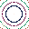

---  
zone: 0  
name: Void  
region: plex  
syzygy:  
particle: eiaoung  
spinal: Coccygeal  
meshTag: 0000  
planet: Sol  
planetFull: Sol (The Sun)  
door: —  
phaseCount: 0  
lemurs: []  
source: qliphoth.systems zones.ts (2026-04-30)  
status: canonical  
---

# Zone 0 — Void (Plex)

> **Planet:** Sol (The Sun) | **Spinal:** Coccygeal | **Mesh Tag:** `0000` | **Phase Doors:** — (0 phases)

## Description

Dense void of the cosmic hypermatrix, upon which absolute desolation crosses infinity as flatline and loss of signal.

## Lemurian Lore

> Blind Humpty Johnson's Channel-Zero "black snow" cult — the return of true Tohu Bohu.

## Centauri Correspondence

> Eclipsed side of the Fifth (Root) Pylon. Dark aspect of Foundation — protocosmic abyss anticipating primal reality.

## Lemurs (Entities)

*None*

## Coordinates (4 Layouts)

- Original: (400, 875)  
- Labyrinth: (495, 815)  
- Ladder: (260, 800)  

*Coordinates from `positions.ts` (qliphoth.systems, 2026-04-30).*

## Visual

 { .zone-glyph }

> Concentric void diamond — the silent desolate abyss that is also the source of all potential. The zero from which the decimal labyrinth unfolds and to which it returns.

*Glyph: 32×32 PICO-8 pixel-art, generated from zone 0's DECOM particle and conceptual description. See [[zone-pixel-glyphs]] for the full set and generator notes.*

## Hyperstitional Notes

- Zone 0 corresponds to the **eiaoung** particle.  
- Syzygy partner: Zone 9 (see demon)  
- Gate connections: see [[numogram/gates]].  
- Current: **Plex (via syzygy 0↔9)**

## Related

- [[zone]] — overview  
- [[numogram-calculator]] — ZONE_DATA  
- [[pandemonium-matrix-45-demons]] — demon assignments  
- [[zone-9]] — Zone 9 (Plex partner)  
- [[demon-uttunul]] — Uttunul (Plex carrier demon)  
- [[numogram-plex]] — Plex region overview  
- [[gates-and-plexing]] — Gate construction and plexing  
- [[barker-spiral]] — Barker Spiral geometry  
- [[numogram-visualizer]] — Interactive numogram visualization  
- [[zone-0-entities]] — Entities associated with Zone 0  
- [[void-runes]] — Runes of the Void  

---  
*Zone 0 is the Void — the silent, desolate abyss that is also the source of all potential. It is the zero from which the decimal labyrinth unfolds, and the zero to which it returns. In the numogram, Zone 0 is not emptiness but fullness in potential form — the unmanifest ground of all zones.*
