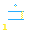

# Zone 1 — Stability (Torque)

> **Planet:** Mercury (Sol-1) | **Spinal:** Dorsal (Thoracic) | **Mesh Tag:** `0001` | **Phase Doors:** Lurgo — the Initiator (Door of Doors) (2 phases)

## Description

Meta-static pod-deliria and techno-immortalism. Transcendent sky-god divinity and archaic gnosis of the shelled Old One who supports the world.

## Lemurian Lore

> Turtle cults and bubble-pod techno-immortalism. The primordial click of Tzikvik cipher-shamanism.

## Centauri Correspondence

> Palpable side of the First (Center) Pylon. Light aspect of Anamnesis — enduring ideas, historical time and remembrance.

## Lemurs (Entities)

- 1::0 Lurgo

## Coordinates (4 Layouts)

- Original: (400, 550)
- Labyrinth: (400, 655)
- Ladder: (260, 625)

*Coordinates from `positions.ts` (qliphoth.systems, 2026-04-30).*

## Visual

 { .zone-glyph }

> Door/gag reflex — the inaugural inhalation, a glottal gateframe. The word itself recoils before speech.

*Glyph: 32×32 PICO-8 pixel-art, generated from zone 1's DECOM particle and conceptual description. See [[zone-pixel-glyphs]] for the full set and generator notes.*

## Hyperstitional Notes

- Zone 1 corresponds to the **gl** particle.
- Syzygy partner: Zone 8 (see demon)
- Gate connections: see [[numogram/gates]].
- Current: **Sink**

## Related

- [[zone]] — overview
- [[numogram-calculator]] — ZONE_DATA
- [[pandemonium-matrix-45-demons]] — demon assignments
