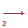

# Zone 2 — Separation (Torque)

> **Planet:** Venus (Sol-2) | **Spinal:** — | **Mesh Tag:** `0003` | **Phase Doors:** Duoddod — Main Lo-Way into the Crypt (4 phases)

## Description

Crypt-navigation, occulted cyberspace. Spectral populations of hallucination and time fragmentation — greys, ghosts and zombies.

## Lemurian Lore

> Mirrors Zone-5 — shared Hyperborean themes of time-lapse and abduction. Mist, vaporization and hazing.

## Centauri Correspondence

> Eclipsed side of the Second (Right) Pylon. Dark aspect of Genesis — epidemic fertility, clones, vampiric contagion.

## Lemurs (Entities)

- 2::0 Duoddod
- 2::1 Doogu

## Coordinates (4 Layouts)

- Original: (560, 275)
- Labyrinth: (400, 220)
- Ladder: (260, 450)

*Coordinates from `positions.ts` (qliphoth.systems, 2026-04-30).*

## Visual

 { .zone-glyph }

> Imploded fricative, stutter fracture, angle tick — the Shperer fracture vertical. A break that never quite closes.

*Glyph: 32×32 PICO-8 pixel-art, generated from zone 2's DECOM particle and conceptual description. See [[zone-pixel-glyphs]] for the full set and generator notes.*

## Hyperstitional Notes

- Zone 2 corresponds to the **dt** particle.
- Syzygy partner: Zone 7 (see demon)
- Gate connections: see [[numogram/gates]].
- Current: **None**

## Related

- [[zone]] — overview
- [[numogram-calculator]] — ZONE_DATA
- [[pandemonium-matrix-45-demons]] — demon assignments

**Pentagram coordinate:** **Outer ring right** (0° vertex in chord-pentagram)
