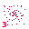

# Zone 3 — Release (Warp)

> **Planet:** Earth (Sol-3) | **Spinal:** Third-eye plane | **Mesh Tag:** `0007` | **Phase Doors:** Ixix — opens onto the Swirl (8 phases)

## Description

Swirling nebulae, cosmic dust clouds and alien pattern. Vortical involvement with Zone-6 problematizes distinct characterization.

## Lemurian Lore

> Swarming insectoid reversion within mammalian vocality. The buzz-cutter sonics of particle zx.

## Centauri Correspondence

> Active side of the Fourth (Crown) Pylon. Light aspect of Fortune — extrinsic fatality, unexpected messages, xenosignal.

## Lemurs (Entities)

- 3::0 Ixix
- 3::1 Ixigool
- 3::2 Ixidod

## Coordinates (4 Layouts)

- Original: (420, 115)
- Labyrinth: (495, 60)
- Ladder: (260, 275)

*Coordinates from `positions.ts` (qliphoth.systems, 2026-04-30).*

## Visual

 { .zone-glyph }

> Buzz-cutter static, radial spokes. When you hear static you are hearing this zone — burning excitement, breakthrough, ominous transition.

*Glyph: 32×32 PICO-8 pixel-art, generated from zone 3's DECOM particle and conceptual description. See [[zone-pixel-glyphs]] for the full set and generator notes.*

## Hyperstitional Notes

- Zone 3 corresponds to the **zx** particle.
- Syzygy partner: Zone 6 (see demon)
- Gate connections: see [[numogram/gates]].
- Current: **Warp** (c=3, self-folding vortex)

### The Warp Basin: No Rest State

In the Esoteric Tetractys derived from Masonic arithmetic, Zone 3 belongs to the only basin that **does not converge to a single digit**:

| Basin | Zones | Behaviour |
|-------|-------|-----------|
| 0 | 0 | Obstinate — goes to itself |
| 9 | 8, 9 | Converge to 9 |
| 1 | 1, 4, 7 | Converge to 1 |
| **3↔6** | **2, 3, 5, 6** | **Self-looping — no fixed point** |

Land on the Warp basin:

> *"There's no rest state in that basin at all. Instead, it's just once you're in the vortex, that's it. You've arrived. That's the thing. The terminus is the vortex."*

Zone 3 appears at T₂=3 — the triangular number iterates: 3→T₃=6→T₆=21→dr(21)=3→T₃=6... ad infinitum. This is the **pure vortex**: the only basin in the entire decimal system that doesn't reduce to a single stable digit.

### Chaotic Xenodemons

From Zone 3, certain crossings are structurally impossible. Land:

> *"Six cannot get out of the 63 vortex. Nine can cross over to zero. It can go through a gate to itself. It can't climb its way up into the time circuit. Nothing can get into the time circuit from the outside. And there's no routes outside the time circuit between the two different outer zones."*

Demons crossing 6::9, 9::6, 3::9, and 9::3 are **chaotic xenodemons** — entities defined by the precision of their inaccessibility. You can state exactly *why* they cannot be reached, which is more informative than a philosophical claim about "the unknowable."

### The Triangular Affinity

Land: *"If you try doing squares rather than triangles, it just does nothing. It dies. You can't get out of the Time Circuit."*

Zone 3's special relationship with triangular numbers (3 is itself triangular, and the Warp basin is the only one organized by a triangular self-loop) makes it the **primary site of triangular cumulation** in the Numogram. Every triangular number Tₙ reduces to the 3↔6 cycle or to 9 (the Plex plunge at T₈=36, T₉=45). The Warp is triangularity made temporal.

## Related

- [[zone]] — overview
- [[numogram-calculator]] — ZONE_DATA
- [[pandemonium-matrix-45-demons]] — demon assignments
