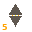

# Zone 5 — Pressure (Torque)

> **Planet:** Jupiter (Sol-5) | **Spinal:** — | **Mesh Tag:** `0031` | **Phase Doors:** Tokhatto — the Hyperborean Door (32 phases)

## Description

Hyperborean or Wendigo mythology. Missing time and alien abduction. Inner-eye of the Barker spiral.

## Lemurian Lore

> Upland rain forests of the Tak Nma. Hybrid bird-reptile forms — flying worms, bat-monsters and barking snakes.

## Centauri Correspondence

> Active side of the Third (Left) Pylon. Light aspect of Apocalypse — decision, judgement, and war.

## Lemurs (Entities)

- 5::0 Tokhatto
- 5::1 Tukkamu
- 5::2 Kuttadid
- 5::3 Tikkitix
- 5::4 Katak

## Coordinates (4 Layouts)

- Original: (250, 370)
- Labyrinth: (200, 335)
- Ladder: (540, 100)

*Coordinates from `positions.ts` (qliphoth.systems, 2026-04-30).*

## Visual

 { .zone-glyph }

> Diamond constriction — two triangles pinching toward a gold pressure thread. The Atlantean Hinge, self-decadence, golden ratio compression.

*Glyph: 32×32 PICO-8 pixel-art, generated from zone 5's DECOM particle and conceptual description. See [[zone-pixel-glyphs]] for the full set and generator notes.*

## Hyperstitional Notes

- Zone 5 corresponds to the **ktt** particle.
- Syzygy partner: Zone 4 (see demon)
- Gate connections: see [[numogram/gates]].
- Current: **Hold**

### Katak's Domain — The Apocalyptic Convergence

Zone 5 is the Presssure side of the 4::5 syzygy — the pair that Land identifies as the numogram's most structurally loaded connection. At this syzygy, **gate and current perfectly reinforce each other**: all paths converge on Zone 1 simultaneously.

Land: *"This is the age of Katak — it's the end of the cycle. This is very apocalyptic. There's no alternative. Has to go this way. You can't get off it in any way."*

In the Esoteric Tetractys, Zone 5 falls into the Warp 3↔6 basin: T₅=15 → dr(15)=6, entering the vortex with no rest state. This means Katak — the 4::5 carrier demon — operates at the boundary between the Time Circuit (where 4::5 is the stabilizing pair with the smallest current, c=1) and the Warp (where 5's triangular cumulation feeds the 3↔6 vortex).

### Iron Law of Six Position

Zone 5 is 2⁵ in the power-of-2 cycle — the penultimate position before the cycle resets through Zone 1. It is also the final member of the **inverse triangle** (8-7-5), the median strip triangle that mirrors the ascending 1-2-4 triangle across the hexagram's point of extimacy.

## Related

- [[zone]] — overview
- [[numogram-calculator]] — ZONE_DATA
- [[pandemonium-matrix-45-demons]] — demon assignments

**Pentagram coordinate:** **Inner ring apex / Valley zone 5** (90° inner vertex)
