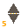

# Zone 5 — Pressure (Torque)

> **Planet:** Jupiter (Sol-5) | **Spinal:** — | **Mesh Tag:** `0031` | **Phase Doors:** Tokhatto — the Hyperborean Door (32 phases)

## Description

Hyperborean or Wendigo mythology. Missing time and alien abduction. Inner-eye of the Barker spiral.

## Numeral

The figure **5** is of the **ophidian-symmetric type** (see [[zone-2]]). Its upper-case echo 'S' shares this geometry — twin snakes coiling around a central axis.

The Roman **V** is not alphabetical but a numerical figure linking to pre-symbolic tallying systems (the 'five-bar gate' pattern still visible in binary up-count displays).

> 5 is the **third odd number** (odditude 2) and **third prime** (fifth prime = 11). It is one of the two prime factors of the decimal module (with 2) — usually attributed to five fingers per hand, the basis of most currency and counting systems.  
> Digital cumulation: 5 → 15.  
> Numeric keypad direction: **Centre**.  
> (Observe: T₅ = 15 → dr(15) = 6, feeding the 3↔6 Warp vortex in the Esoteric Tetractys.)

**Anthropomorphic resonances are disturbed by pentagonal body-plans.** The five senses, the five spinal levels (coccygeal → cervical), and the starfish as pre-eminent example. The Cthulhu Mythos encodes this aberrancy as the "pentagonal" body-plans of the Old Ones — Lovecraft's subconscious numogram.

**Wu Xing:** 5 maps to **Wood → Wind** (fibular element), the generatrix that seeds growth before Metal cuts it back. In the five-phase cycle, Wood creates Fire and is overcome by Metal; 5 sits at the inflection where creation has peaked and the knife enters. This implicates Zone 5 as the threshold of **self-destructive transcendence** — pressure building until the system cracks itself open.

| Tradition | Five |
|---|---|
| Monotheistic | Pentateuch; five pillars of Islam (arkan) |
| Chinese alchemy | Five elements (Wood/Wind) |
| Occult geometry | Pentagram, Pentazygon, Atlantean Cross (five stations) |
| Secular | Pentagon, Five-year plans, Intel Pentium |

## Lemurian Lore

> Upland rain forests of the Tak Nma. Hybrid bird-reptile forms — flying worms, bat-monsters and barking snakes.

**Stillwell's Nma ethnography** maps Zone-5 to the **upland rain forests** of the **Tak Nma**, and through the Mu Nma hydrocycle mythos to the **monsoon**. Cecil Curtis describes their art as:  
> *"a flapping howling chaos of flying worms, bat-monsters and barking snakes."*

**Totem animals** are predominantly **hybrid bird-reptile forms**. The Aberrancy intensifier: starfish body-plan (pentagonal symmetry) mirrors the pentagonal alien body-plans of the Lovecraftian Old Ones — the numogram's deep-time leakage into the Cthulhu Mythos.

## Centauri Correspondence

> Active side of the Third (Left) Pylon. Light aspect of Apocalypse — decision, judgement, and war.

## Tokhatto — The Angel of Decadence

**Amphidemon, imp of the first degree.** Ininitiatory aspect, Zone-5 functions as the **Fifth (Hyperborean) Door**, attributed by Muvian sorcery to Tokhatto (5::0). In the inner esoteric circles of the AOE this demon is reverenced as the **Angel of the Decadence Pack**, and even identified with the **Archangel Meteka** — a double-coding reinforced by numerous qabbalistic peculiarities.

## Lemurs (Entities)

| Mesh | Net-Span | Name |
|------|----------|------|
| M#10 | 5::0 | Tokhatto |
| M#11 | 5::1 | Tukkamu |
| M#12 | 5::2 | Kuttadid |
| M#13 | 5::3 | Tikkitix |
| M#14 | 5::4 | Katak |

## Coordinates (4 Layouts)

- Original: (250, 370)
- Labyrinth: (200, 335)
- Ladder: (540, 100)

*Coordinates from `positions.ts` (qliphoth.systems, 2026-04-30). Note: Zn5.htm confirms zone adds Sarkonian Mesh-Tag **0031**.*

## Visual

 { .zone-glyph }

> Diamond constriction — two triangles pinching toward a gold pressure thread. The Atlantean Hinge, self-decadence, golden ratio compression.

*Glyph: 32×32 PICO-8 pixel-art, generated from zone 5's DECOM particle and conceptual description. See [[zone-pixel-glyphs]] for the full set and generator notes.*

## Hyperstitional Notes

- Zone 5 corresponds to the **ktt** particle.
- Syzygy partner: Zone 4 (see demon [[pandemonium-glossary#Katak|Katak]])
- Gate connections: Fifth Gate (Gt-15) → Zone 6; "channel tracks the path of abductions into the Warp"
- Current: **Hold (7-2)**
- Tractor-Zone of the 7-2 'Hold' Current

### Katak's Domain — The Apocalyptic Convergence

Zone 5 is the Pressure side of the 4::5 syzygy — the pair that Land identifies as the numogram's most structurally loaded connection. At this syzygy, **gate and current perfectly reinforce each other**: all paths converge on Zone 1 simultaneously.

Land: *"This is the age of Katak — it's the end of the cycle. This is very apocalyptic. There's no alternative. Has to go this way. You can't get off it in any way."*

In the Esoteric Tetractys, Zone 5 falls into the Warp 3↔6 basin: T₅=15 → dr(15)=6, entering the vortex with no rest state. This means Katak — the 4::5 carrier demon — operates at the boundary between the Time Circuit (where 4::5 is the stabilizing pair with the smallest current, c=1) and the Warp (where 5's triangular cumulation feeds the 3↔6 vortex).

### Iron Law of Six Position

Zone 5 is 2⁵ in the power-of-2 cycle — the penultimate position before the cycle resets through Zone 1. It is also the final member of the **inverse triangle** (8-7-5), the median strip triangle that mirrors the ascending 1-2-4 triangle across the hexagram's point of extimacy.

## Source Material

Primary source: `raw/www.ccru.net/zones/Zn5.htm` (rendered at `http://127.0.0.1:8080/zones/Zn5.htm`).[^1]  
Additional: `raw/www.ccru.net/occultures/mesh.htm` (Mesh-Notes commentary).

## Related

- [[pandemonium-glossary]] — authoritative definitions: Twin System, Demon, K-OS, Mesh, Spinal Catastrophism
- [[zone]] — overview
- [[numogram-calculator]] — ZONE_DATA
- [[pandemonium-matrix]] — 45-demon matrix; Katak carrier/4::5 Sink
- [[apoc-apocalypse-been-in-effect]] — CCRU Pentazygon account; Katak character
- [[zone-2]] — shares Crypt-linked themes of missing time and alien abduction
- [[zone-4]] — 5::4 syzygy partner
- [[mythlemuria]] — Lemurian Planetwork astrozygonomy

Pentagram coordinate: **Inner ring apex / Valley zone 5** (90° inner vertex)

[^1]: Snapshot taken during 2026-06 CCRU raw ingestion run.
