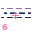

# Zone 6 — Abstraction (Warp)

> **Planet:** Saturn (Sol-6) | **Spinal:** Third-eye plane | **Mesh Tag:** `0063` | **Phase Doors:** Tchu — gate of Undu (64 phases)

## Description

Occulted dimensions of Undu. Turbular erosion and the dead eye of the cyclone. Shocking disappearances.

## Lemurian Lore

> The I Ching hexagrams and Ur-Oriyan Yogini yantras. Permanent hexagon of the Saturnian pole.

## Centauri Correspondence

> Passive side of the Fourth (Crown) Pylon. Dark aspect of Fortune — gnostic death, event horizon, the absolutely unexpected.

## Lemurs (Entities)

- 6::0 Tchu
- 6::1 Djungo
- 6::2 Djuddha
- 6::3 Djynxx
- 6::4 Tchakki
- 6::5 Tchattuk

## Coordinates (4 Layouts)

- Original: (250, 85)
- Labyrinth: (305, 60)
- Ladder: (540, 275)

*Coordinates from `positions.ts` (qliphoth.systems, 2026-04-30).*

## Visual

 { .zone-glyph }

> Portail-â-worm occlusion. Turbular erosion chewing through static time. Navvy-char driven edge in perpetual entering.

*Glyph: 32×32 PICO-8 pixel-art, generated from zone 6's DECOM particle and conceptual description. See [[zone-pixel-glyphs]] for the full set and generator notes.*

## Hyperstitional Notes

- Zone 6 corresponds to the **tch** particle.
- Syzygy partner: Zone 3 (see demon)
- Gate connections: see [[numogram/gates]].
<! ---> The V3 real-resonator SHAP driver: *very_high_ratio dominates (0.0849)*, confirming Z6's acoustic signature as the tube/bow friction zone — extended highs (>8 kHz) + spectral rolloff. [[numogram-audio/real-resonator-shap-driver-signatures]] [[numogram-audio/zone-mapping-consistency]] for full analysis table.
- Current: **None**

## Related

- [[zone]] — overview
- [[numogram-calculator]] — ZONE_DATA
- [[pandemonium-matrix-45-demons]] — demon assignments

**Pentagram coordinate:** **Outer ring down‑left** (135° vertex)
