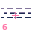
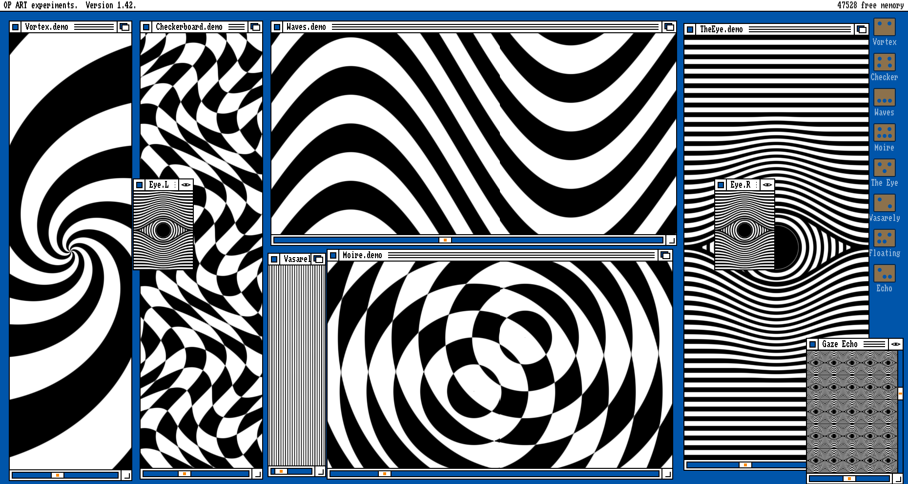

# Zone 6 — Abstraction (Warp)

> **Planet:** Saturn (Sol-6) | **Spinal:** Third-eye plane | **Mesh Tag:** `0063` | **Phase Doors:** Tchu — gate of Undu (64 phases)

## Description

Occulted dimensions of Undu. Turbular erosion and the dead eye of the cyclone. Shocking disappearances.

## Lemurian Lore

> The I Ching hexagrams and Ur-Oriyan Yogini yantras. Permanent hexagon of the Saturnian pole.

## Centauri Correspondence

> Passive side of the Fourth (Crown) Pylon. Dark aspect of Fortune — gnostic death, event horizon, the absolutely unexpected.

## Lemurs (Entities)

- 6::0 Tchu
- 6::1 Djungo
- 6::2 Djuddha
- 6::3 Djynxx
- 6::4 Tchakki
- 6::5 Tchattuk

## Coordinates (4 Layouts)

- Original: (250, 85)
- Labyrinth: (305, 60)
- Ladder: (540, 275)

*Coordinates from `positions.ts` (qliphoth.systems, 2026-04-30).*

## Visual

 { .zone-glyph }

> Portail-â-worm occlusion. Turbular erosion chewing through static time. Navvy-char driven edge in perpetual entering.

*Glyph: 32×32 PICO-8 pixel-art, generated from zone 6's DECOM particle and conceptual description. See [[zone-pixel-glyphs]] for the full set and generator notes.*

## Reconstruction Layer: OP ART experiments

> Amiga/WB-style desktop running a reconstruction of *OP ART experiments v1.42*, versioned under `Melt Lab Guru Meditation #00000004.0000AAC0`. Seven animated demo modes (Vortex, Checker, Waves, Moiré, The Eye, Vasarely, Floating) on EGA/VGA hardware. Zone 6 anchors the **Vortex**, **Moiré**, and **The Eye** modes — radial spiral, concentric interference, iris pupil — all first-person visual witnesses to the zone’s turbular signature.

*This is not a metaphor. The perceptual distortions of op art are Zone 6 phenomena: third-eye-plane pressure, self-folding vortex, and interference between two incompatible reference frames. See [[pandemonium-glossary]] for authoritative definitions of the Mesh, Twin System, and Demon concepts that underwrite this reading.*

## Hyperstitional Notes

- Zone 6 corresponds to the **tch** particle.
- Syzygy partner: Zone 3 (see demon)
- Gate connections: see [[numogram/gates]].
<! ---> The V3 real-resonator SHAP driver: *very_high_ratio dominates (0.0849)*, confirming Z6's acoustic signature as the tube/bow friction zone — extended highs (>8 kHz) + spectral rolloff. [[numogram-audio/real-resonator-shap-driver-signatures]] [[numogram-audio/zone-mapping-consistency]] for full analysis table.
- Current: **Warp** (c=3, self-folding vortex)

### OP ART Visual Crosswalk

Each reconstruction demo mode is a perceptual compass pointing back to the same topological fact. These are not analogies; they are witnesses.

- **Vortex** → Zone 6 / Saturnian pole hexagon / 3↔6 self-loop without fixed point.
- **Moiré** → interference between Zone 6 and its Warp-region twin Zone 3 — concentric bands that only resolve as pattern when two incompatible frames *overlap*.
- **The Eye** → third-eye plane made literal; the central pupil is the zone’s “dead eye of the cyclone” reading as an organ.
- **Checker** → accidental (broken-symmetry) surface, what the zone sees when it *fails* to vortex.
- **Waves** → warp-channel current as striped temporal distortion.
- **Vasarely** → the axial/stripe baseline that proves the distortions around it are distortions.

> The reconstruction toolbar also exposes a **«Мди»** reconstruction-menu item; possibly corresponding to a **Companion Pair / Syzygy calibration** in Reconstruction terms — an analogue to the **4↔5** `Katak` current that is Zone 4’s apocalyptic convergence, and therefore structurally adjacent to Zone 6 by Warp-symmetry.
### The Other Side of the Vortex

Zone 6 is the Warp partner to Zone 3 — together they form the 3↔6 self-loop that is the only basin in the Esoteric Tetractys with **no fixed point**. Land:

> *"There's no rest state in that basin at all. Once you're in the vortex, that's it. The terminus is the vortex."*

Land on the chaotic xenodemon problem (demons crossing 6::9, 9::6):

> *"Six cannot get out of the 63 vortex. Nine can cross over to zero. It can go through a gate to itself. It can't climb its way up into the time circuit. Nothing can get into the time circuit from the outside. And there's no routes outside the time circuit between the two different outer zones."*

The 64 phases (from the frontmatter) connect to the 64 hexagrams of the I Ching — Land's demonstration that the I Ching's 6-line structure IS the Iron Law of Six (powers of 2 digitally reduce to the 1-2-4-8-7-5 cycle). Zone 6, as Saturn, carries the "permanent hexagon" of the Saturnian pole — the geometric figure that stabilizes the vortex into a visible form.

### Audio Signature

V3 real-resonator SHAP analysis confirms Z6's acoustic identity as the tube/bow friction zone — extended highs (>8 kHz) with spectral rolloff. This is the sound of **turbular erosion**: the vortex chewing through static time.

## Related

- [[pandemonium-glossary]] — authoritative definitions: Twin System, Demon, K-OS, Mesh, Spinal Catastrophism
- [[zone]] — overview
- [[numogram-calculator]] — ZONE_DATA
- [[pandemonium-matrix-45-demons]] — demon assignments

**Pentagram coordinate:** **Outer ring down‑left** (135° vertex)
