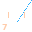

# Zone 7 — Blood (Torque)

> **Planet:** Uranus (Sol-7) | **Spinal:** — | **Mesh Tag:** `0127` | **Phase Doors:** Puppo — Tracts of Dobo (128 phases)

## Description

Emergence from the depths. Hyper-sea water-carriers and amphibious colonization. Cosmic swamp-labyrinths.

## Lemurian Lore

> Coastal swamps of the Dib Nma. Chubby batrachian (burping toad) totem animals.

## Centauri Correspondence

> Active side of the Second (Right) Pylon. Light aspect of Genesis — genealogy, ancestor worship, inherited wealth.

## Lemurs (Entities)

- 7::0 Puppo
- 7::1 Bubbamu
- 7::2 Oddubb
- 7::3 Pabbakis
- 7::4 Ababbatok
- 7::5 Papatakoo
- 7::6 Bobobja

## Coordinates (4 Layouts)

- Original: (580, 400)
- Labyrinth: (600, 335)
- Ladder: (540, 450)

*Coordinates from `positions.ts` (qliphoth.systems, 2026-04-30).*

## Visual

 { .zone-glyph }

> Lips-flap-ascent, trailing breath-wisp diagonal rising. The bsigh particle: a sigh that swallows its own echo then drifts upward.

*Glyph: 32×32 PICO-8 pixel-art, generated from zone 7's DECOM particle and conceptual description. See [[zone-pixel-glyphs]] for the full set and generator notes.*

## Hyperstitional Notes

- Zone 7 corresponds to the **pb** particle.
- Syzygy partner: Zone 2 (see demon)
- Gate connections: see [[numogram/gates]].
- Current: **Surge** (c=5, strong drive)

### Iron Law of Six Position

Zone 7 is **2⁴ = 16 → dr(16) = 7** — the first descending node of the inverse triangle (8-7-5) in the hexagram kernel. After the median strip flip at Zone 8, the cycle descends through 7 toward the valley at Zone 5. This is the "other side of two" in Land's extimacy structure: the inverse triangle's second member mirrors the ascending triangle's second member across the hexagram's central axis.

In the Esoteric Tetractys, Zone 7 belongs to the **1-basin** with Zones 1 and 4 — all three converge to digital root 1 under Masonic arithmetic. This puts Zone 7 in a structural tension: it is a member of the stable-identity cluster (1-basin) but functions as the descending momentum of the inverse triangle (8-7-5). The Blood zone is stability in downward transit.

### The Seventh Gate — Retrochronic Reversal

Land explicitly identifies the Gt-28 counter-cyclic path as a key feature:

> *"There's the seventh gate which just purely has this function of a sort of retrochronic reversal. You go from 1 and 8 to 7 and then back to 8 again down that thing. So there's a time loop in that thing."*

This is the only retrochronic path within the Time Circuit — a functional time loop that does not require exiting to Warp or Plex. The Gate of Relapse (as the Black-Atlantean lore names it) allows backward traversal from Zone 7 to Zone 1, and from Zone 1 back to Zone 8, creating a sub-cycle within the anticlockwise rotor. This is the temporal signature of the "amphibious" zone: the ability to reverse evolutionary direction and return to an earlier state.

### Seven and the Diagonal

The numeral 7 contains the only pure diagonal among decimal digits — it escapes the vertical/horizontal axis that governs 1, 4, and the rotational symmetry of 0, 8. Land's "the seven is askance" (noted at AQ 333) connects Zone 7 to the xeno-vector: the path that does not run straight through the Time Circuit but cuts across it at an angle. The seventh gate's retrochronic function literalises this diagonal: it is the path that moves against the current.

Land also identifies iambic pentameter's drift toward 666 AQ (Beast Pulse). Zone 7's number — 777 as the Law of Thelema in AQ — sits adjacent: if 666 is the line of iambic pentameter, 777 is its theological echo (Crowley's *777*) and 7's diagonal numeral the visual signature of the askance path through the system.

## Related

- [[zone]] — overview
- [[numogram-calculator]] — ZONE_DATA
- [[pandemonium-matrix-45-demons]] — demon assignments

**Pentagram coordinate:** **Inner ring down‑left** (180° vertex in inner ring, Valley side)

---

## Raw Source Notes (from `raw/gist/7.txt`)

The canonical CCRU zone source contains material not yet integrated into this page:

### Numeral 7
The figure 7 contains the only pure diagonal among numerals — it breaks rotational symmetry with the letter 'L' and connects ideographically to the lightning-stroke. Keypad direction: North-West. Digitally cumulates to 28 (T₇).

### Seventh Gate (Gt-28)
Gt-28 feeds Zone 7 back to Zone 1 — a counter-cyclic path within the Torque, known in Black-Atlantean lore as the **Gate of Relapse**. The aquassassins of Hyper-C fetishize this gate in their "Bubble Pod" mysteries. It is the only counter-cyclic path within the Torque region, and one of three gates concluding in Zone 1.

### Uranus in Lemurian Planetwork
In Lemurian astrology, Uranus (Sol-7, 84-year orbit, 5+10 moons, abnormally tilted rotation creating a warped magnetic field) is **astrozygonomously paired with Venus**. Its Greek mythological origin — Cronos castrating Uranus, spawning the Furies from blood and Aphrodite from severed genitals — resonates with Zone 7's association with blood, emergence, and amphibious birth from the depths.

### Munumese Phonetics per Stillwell
Stillwell links Zone 7 to the quasiphonic particle **'pb'** — described by Horowitz as a "compounded plosive." This is the phonetic signature of the Blood zone: a sound that begins with containment and releases explosively, like a sigh that becomes a swallow.

### Ethno-Topography
Her ethno-topography of the Nma allocates Zone 7 to the coastal swamps of the Dib Nma, connected through the Mu Nma hydrocycle mythos to salt-water marshes. Totem animals are predominantly chubby batrachians — burping toads.

### Biblical Heptamania
Revelation is the probable source of seven's structural ambivalence in popular Christianity, attributing to it both the seven cardinal virtues AND the seven deadly sins. Crowley's *777* corresponds to the AQ gematria of the Law of Thelema. Blavatsky's seven root races are a key intermediary between biblical and Lemurian uses of the number.

---

## Source Text: Amphibious Maidens (Swarm 3, CCRU)

A primary CCRU source for Zone 7 is **"Amphibious Maidens"** by Suzanne Livingstone, Luciana Parisi, and Anna Greenspan, published in *Swarm 3* of the Cybernetic Culture Research Unit's abstract culture journal.

Located at `raw/www.ccru.net/swarm3/3_amph.htm`, this dense theoretical text weaves together:

- **DAY OF BLOOD** — Kali's third eye, menstrual cyclicity, "blood will be drawn." Blood as metal: haemoglobin composed of iron and oxygen, the body as "metallic assemblage of posthuman life." *"She is bleeding metal, the iron of the earth."*
- **Amphibian becomings** — *"The move to dry land is not an irreversible process."* A woman carries in her waters an amphibian's complete environment. The body can return to the hydral state — cracking the shell, detopologising the surface, following kundalini from the base of the spine.
- **The third eye as zero point of temporality** — Ida and Pingala (solar/lunar spinal tracts) are engulfed by Susumna when the third eye opens, *"the cranium melts, the body's rear head pierces through and emerges outside time."* The third eye is the zero point from which the cycle begins again.
- **Lilith and Kali as twinned** — not opposed as light/dark but a coupled becoming. *"Day and night are mingled in our gazes."*
- **Closes with I Ching Hexagram 24 (Fu/Return)** — "On the seventh day comes return." The seventh day of a seven-day structure, the Blood zone's signature number.

This text establishes Zone 7 as the numogram's amphibious threshold — the zone where time is not linear but cyclic, where blood is metal, and where the body's evolutionary history can be rewound. The seventh day as return is the numogram's own logic: the syzygy 7::2 (Oddubb) is a doubling that folds back on itself, the Hold current that resists forward motion.
